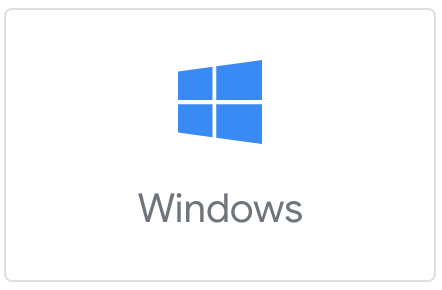
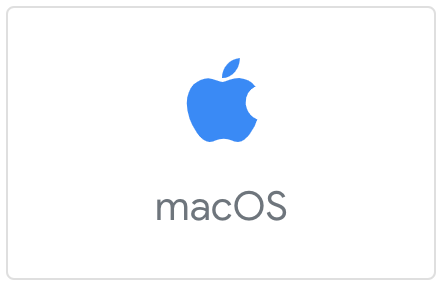
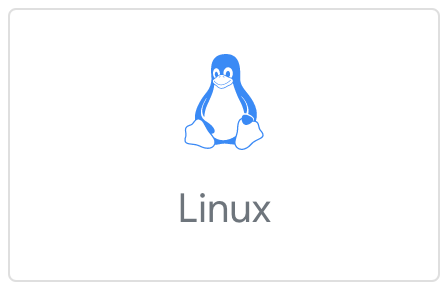

# 安装和环境配置

## 开发环境要求 

- macOS / Windows / Linux
- Flutter SDK
- PlayBox Go 移动应用
- VSCode

## 安装 Flutter SDK

请选择你当前所使用的操作系统，参照 Flutter 文档安装好 Flutter SDK。

|  Windows | macOS | Linux |
|  ----  |  ----  |  ----  |
|   |   |   |

只需要保证 `flutter doctor` 能正确运行并输出就可以，`PlayBox` 不需要开发者安装 `Android Studio` 和 `Xcode`。

## 安装 PlayBox Go 应用

PlayBox Go 是一款移动应用，我们可以使用该应用，实时预览正在开发的小程序。

**iOS** 用户可以通过扫描以下二维码在 AppStore 下载：

**Android** 用户可以通过扫描（不建议使用微信扫描）以下二维码直接下载 apk 进行安装：

## 下一步

OK，你已经完成 PlayBox 所需的环境配置了。

[接下来，我们尝试使用 PlayBox 开发第一个专属于你的小程序吧。](./first-app)