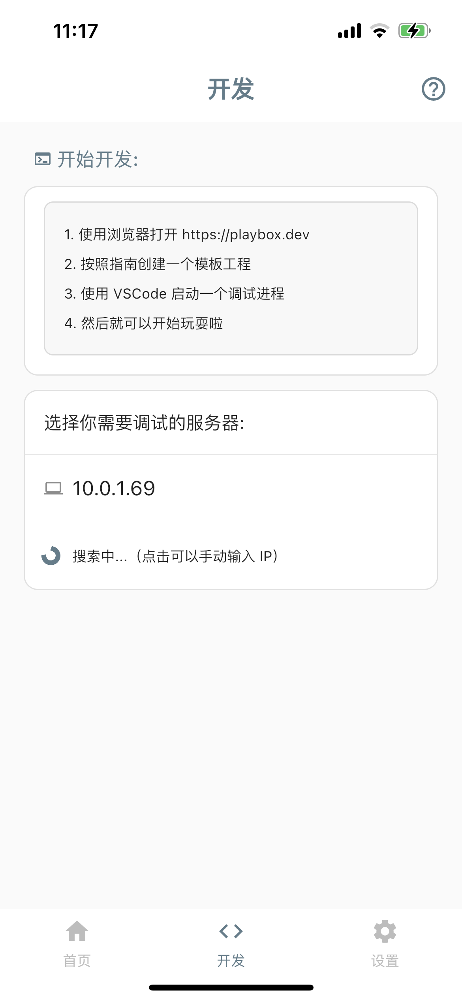

# 编写第一个 PlayBox 小程序

通过本文档，你将可以在本地创建一个模板工程，并运行在 PlayBox Go 真机上。

我们还将指导你使用 VSCode 实时调试小程序。

请确保你的[开发环境](./env-setup)已经准备就绪。

## 创建模板工程

直接点击[这里](https://dist.mpflutter.com/playbox_template.zip)下载模板工程，并解压到任意一个目录。

## 安装依赖

使用 VSCode 打开刚刚解压得到的工程根目录，在命令行中执行以下命令。

```
./mpflutter packages get
```

> 注意，这里用的是 ./mpflutter 而不是 flutter！

## 运行应用

保持在 VSCode 窗口中，按下键盘【F5】键（也可以使用鼠标点开调试栏启动调试），开始调试。


稍等片刻，调试控制台中会出现以下信息（如果没有出现该信息，请重新启动调试）。


此时，在移动设备上打开 PlayBox Go 应用，切换到【开发】Tab 页。

PlayBox Go 会自动查找同一网段中正在调试的机器，如下图所示。



> 如果你的电脑 IP 没有出现在 PlayBox Go 中，请确认你的电脑和你的手机都处于同一个局域网中，并且在同一 IP 段。

点击已经查找到的 IP，再点击【开始调试】，稍等片刻，应用界面就会出现在设备上。


## 尝试热重载

MPFlutter 和 PlayBox Go 通过 **热重载** 提供快速开发周期，该功能支持应用程序在运行状态下重载代码而无需重新启动应用程序或者丢失程序运行状态。修改一下代码，然后告诉IDE或者命令行工具你需要热重载，然后看一下模拟器或者设备上应用的变化

1. 打开 `lib/main.dart`。

2. 修改字符串

`
'Hello, MPFlutter!'
`
改为

`
'Hello, World!'
`

3. 不要 停止应用。保持应用处于运行状态。

保存修改

你会发现修改后的字符串几乎马上出现在正在运行的 PlayBox Go 上。

## 尝试断点

1. 打开 `lib/main.dart`。

2. 在第 33 行处，添加断点，如下图。


3. 在 PlayBox Go 中，点击『蓝色区域』，此时，VSCode 会收到断点信息，并停留在断点处，你可以尝试在此进行断点调试。

## 下一步

OK，你已经可以在调试模式下跑起一个 Hello, World 小程序了。

接下来，你可以：

- [构建并上传小程序到 PlayBox Go](./upload-app)
- [使用 PlayBox SDK 获取更多设备能力](../sdk/intro)