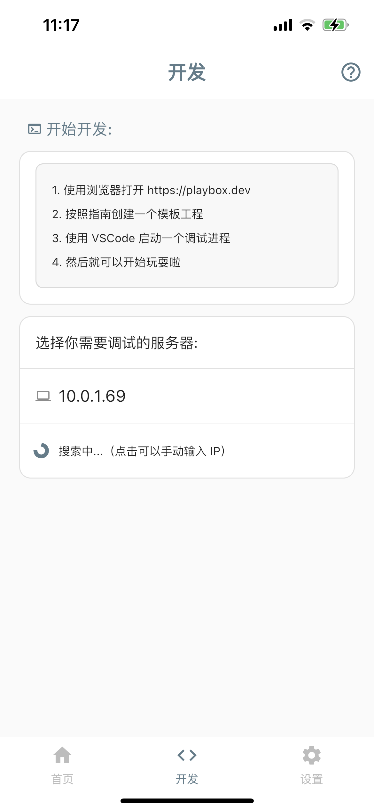
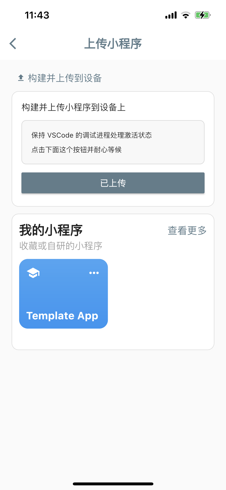
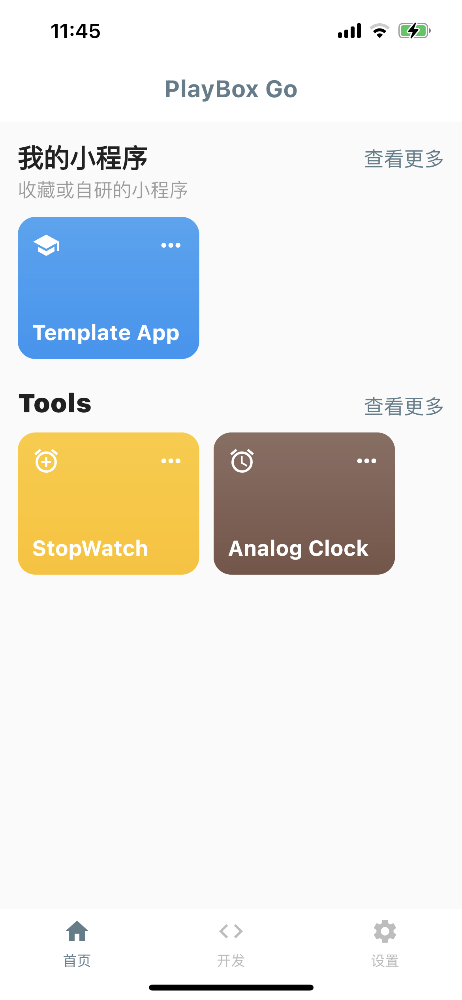

# 构建、上传小程序

通过本文档，你将可以让在本地开发、调试完成的小程序，上传到 PlayBox Go 中。

只有构建并上传到 PlayBox Go 中的小程序才能在脱离 VSCode 的情况下使用。

请确保你已经完成[《Hello, World 指南》](./first-app)学习。

## 修改应用信息

在上传应用前，我们需要先修改一下小程序的概要信息，使用 VSCode 打开 `lib/playbox.config.dart`。

```dart
import 'dart:convert';

import 'package:flutter/material.dart';
import 'package:mpcore/mpcore.dart';

Future<Widget?>? main(List<String> args) async {
  final appConfig = PlayBoxAppConfig(
    appId: 'template_app',
    coverInfo: PlayBoxCoverInfo(
      name: 'Template App',
      color: Colors.blue,
      icon: MaterialIcons.school,
    ),
    categoryInfo: PlayBoxCategoryInfo(name: 'Template'),
  );
  print(json.encode(appConfig));
  return null;
}
```

- appId, 用于标识这个应用的唯一性。
- coverInfo，用于在 DashBoard 首页中展示小程序信息。
- categoryInfo, 用于在 DashBoard 首页中区分小程序类别。

## 触发构建

在 VSCode 中，保持调试进程处于激活状态，并在 PlayBox Go 可寻找到该调试进程。



点击已经查找到的 IP，再点击【上传小程序】。

在新推入的页面中，点击【构建并上传】，稍等片刻，会出现以下界面。



这样，小程序就已经完成构建和上传了，你可以直接点击上面的蓝色框框在脱离 VSCode 的情况下体验小程序了。

## 在首页中打开

上传完成的小程序将出现在 PlayBox Go 首页，你可以直接在首页打开使用。

